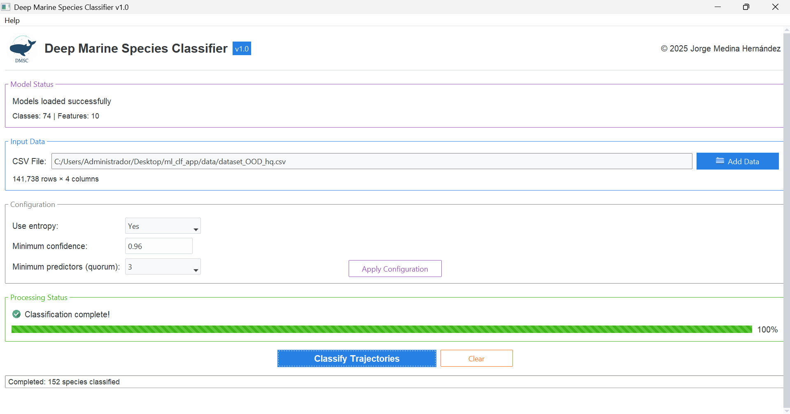

<div align="center">
  
  <h1>Deep Marine Species Classifier</h1>
</div>

## Overview

Deep Marine Species Classifier (DMSC) is a desktop application that classifies marine-animal satellite trajectories using an ensemble of deep learning models with confidence-based abstention. It is designed to deliver high accuracy for in-distribution species (present in the train set) while abstaining from classifying out-of-distribution species. The code for training the models and conducting the analyses presented in the article ***Machine Learning Based Species Classification in Marine Environments*** will be added to the [GitHub repository](https://github.com/medinajorge/Marine-species-identification) upon publication.


<p align="center">
  
</p>

## Running the Application

### Linux
```bash
chmod +x DMSC.AppImage
./DMSC.AppImage
```

### Windows
Double-click `DMSC.exe` or run it from the command prompt.

## Usage

1. **Wait for models to load** - Progress displayed in the Model Status section
2. **Click "Add Data"** to select your input CSV file
3. **(Optional) Adjust configuration parameters** and click "Apply Configuration"
4. **Click "Classify Trajectories"** to begin processing
5. **Choose a location** to save the output file
6. **Wait for processing** to complete

## Configuration Options

* **Use entropy**: whether to include entropy as an input to the confidence model.

  * *Yes*: use entropy + species probabilities (recommended).
  * *No*: use species probabilities only.

* **Minimum confidence**: threshold below which a model’s prediction is considered an abstention.

  * *Default*: `0.96`
  * *Range*: `0.0` – `1.0`

* **Minimum predictors (*quorum*)**: minimum number of non-abstaining models (out of 5) required for the ensemble to output a prediction.

  * If the number of predicting models > quorum, the ensemble chooses the most frequent species among them; otherwise it abstains.
  * *Default*: `3`
  * *Options*: `1, 2, 3, 4, 5`

## Input File Format

The input must be a CSV containing trajectory observations with at least these columns:

* `LATITUDE` — latitude (degrees)
* `LONGITUDE` — longitude (degrees)
* `DATE_TIME` — timestamp of the observation
* `ID` — unique identifier for each animal trajectory.

#### Example input file

```plaintext
ID,LATITUDE,LONGITUDE,DATE_TIME,
A123,-34.9285,138.6007,2020-01-0112:00:00
A123,-33.8688,138.8093,2020-01-0113:00:00
...
```

> Note: Trajectories with fewer than 2 observations will not be considered for classification.

## Output File Format

The output CSV contains, per trajectory (ID):

* `ID`
* `num_observations` — number of observations
* `num_days` — duration in days
* `tracking_quality` — `high` if ≥ 50 observations **and** ≥ 5 days; `low` otherwise
* `species_prediction_fold_i` (i=1..5) — individual model predictions
* `confidence_fold_i` (i=1..5) — individual model confidence scores
* `species_predicted` — final species prediction (ensemble prediction)
* `abstained` — `True` / `False` indicating ensemble abstention for low-confidence predictions.

## Expected Performance

**Classifier Goals:**
- **In-distribution (ID)** species, present in the training data -> High accuracy and low abstention rates
- **Out-of-distribution (OOD)** species, absent from the training data -> High abstention rates (any classification would be wrong)

Expected performance for the default configuration (`use entropy = True`, `minimum confidence = 0.96`, `quorum = 3`):

| Metric | Tracking Quality | In-distribution (ID) | Out-of-distribution (OOD) |
| :--- | :--- | :--- | :--- |
| **Macro-accuracy** | High | 99.2% <small> (95% CI: [99.0, 100]) </small> | N/A (Always incorrect) |
| | Low  | 97.1% (95% CI: [87.2, 100]) | N/A (Always incorrect) |
| **Abstention Rate** | High | 34.6% <small>(95% CI: [29.6, 40.7])</small> | 88.8% <small>(95% CI: [82.9, 94.1])</small> |
| | Low | 94.2% <small>(95% CI: [88.4, 96.2])</small> | 99.9% <small>(95% CI: [99.1, 100.0])</small> |

> [!TIP]
> Increasing minimum confidence or quorum raises ID accuracy and OOD abstention, at the cost of higher ID abstention.

## Available Species

The models can predict across **74 marine species**:

| | | | |
| :--- | :--- | :--- | :--- |
| **Birds**: 31 | **Seals**: 13 | **Cetaceans**: 9 | **Fishes**: 8 |
| **Turtles**: 6 | **Penguins**: 5 | **Polar bears**: 1 | **Sirenians**: 1 |

---

*(For the full species list, see <kbd>Help</kbd> > <kbd>About</kbd> in the desktop application.)*

## Model Features

Deep learning models use 10 features derived from the input trajectory:

* Cartesian coordinates `(x, y, z)`
* Day-of-year (split into sine/cosine with precision up to seconds)
* Hour angle (split into sine/cosine)
* Bathymetry (GEBCO 2022, coarse-grained to 0.25º cells)
* Time interval between observations
* Velocity between observations

## Author

© 2025 Jorge Medina Hernández

Contact: [medinahdezjorge@gmail.com](mailto:medinahdezjorge@gmail.com)


